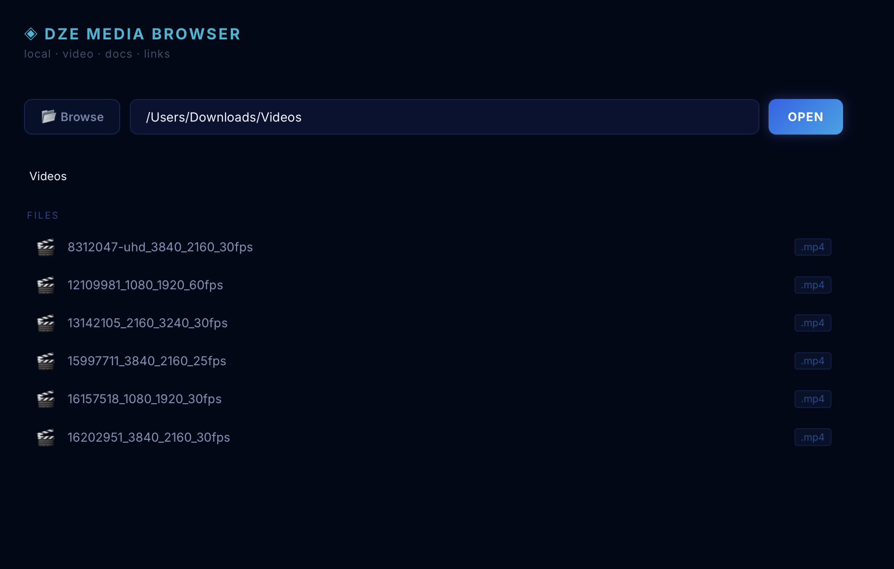

A simple media browser to browse and play local media; currently support mp4 and srt subtitles. Have fun watching your videos.

## Getting Started

First, run the development server:

```bash
npm install
npm run dev
```

Open [http://localhost:3000](http://localhost:3000) with your browser .

Select a folder to start.


